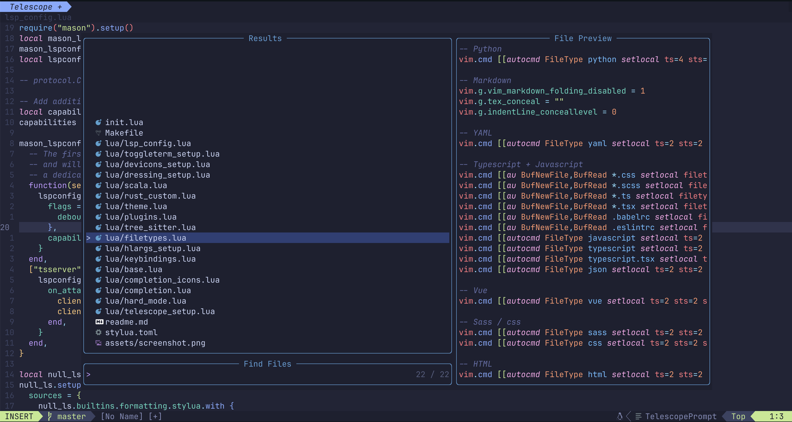

# Neovim config



## Features

 - linting and completion using LSP
 - syntax highlighting using TreeSitter
 - fuzzy finder using FZF
 - airline

## Installation

 - install Nerd font - https://github.com/ryanoasis/nerd-fonts
 - install packer.vim - https://github.com/wbthomason/packer.nvim
 - run `:PackerCompile` + `:PackerInstall`
 - TreeSitter update should happen automatically after the initial installation but you can trigger it with `:TSUpdate`

## Installing languages LSP

```
:LspInstall <language-name>
```

## Keybindings

### General

| Key                   | Action                                        |
|-----------------------|-----------------------------------------------|
| `<space><space>`      | Find file                                     |
| `<space>a`            | Fulltext search in files                      |
| `<space>b`            | Search open buffers                           |
| `<C-c><C-c>`          | clean selection (the same as :noh)            |
| `<C-h>`               | Left window                                   |
| `<C-l>`               | Right window                                  |
| `<C-k>`               | Top window                                    |
| `<C-j>`               | Bottom window                                 |
| `gc`                  | Delete buffer                                 |
| `gn`                  | Next buffer                                   |
| `gN`                  | Previous buffer                               |
| `gC`                  | Delete all buffers but the selected one       |

### LSP

| Key                   | Action                                        |
|-----------------------|-----------------------------------------------|
| `gd`                  | Go to definition                              |
| `<space>f`            | Format file                                   |
| `K`                   | Show information about symbol under cursor    |
| `C-K`                 | Show signature of a function under cursor     |
| `gR`                  | Rename a symbol under cursor                  |
| `gr`                  | Show references of a symbol under cursor      |
| `<space>ca`           | Code actions                                  |
| `<space>e`            | Show line diagnostics                         |
| `[e`                  | Diagnostic: previous                          |
| `]e`                  | Diagnostic: next                              |

## TODO

 - formatting
